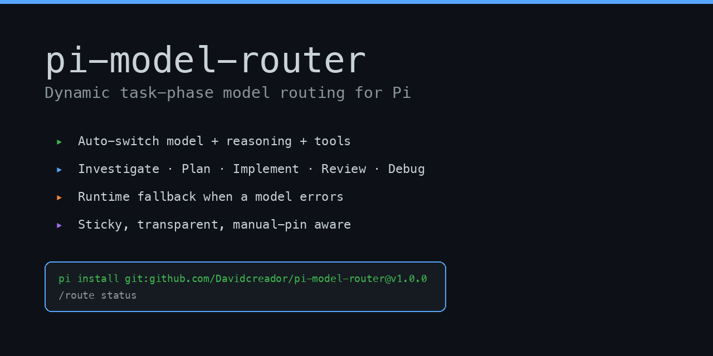
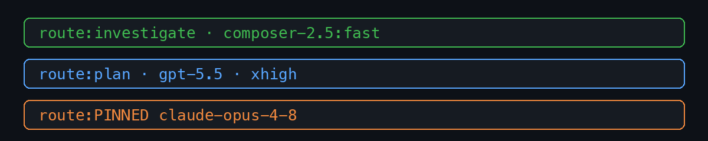
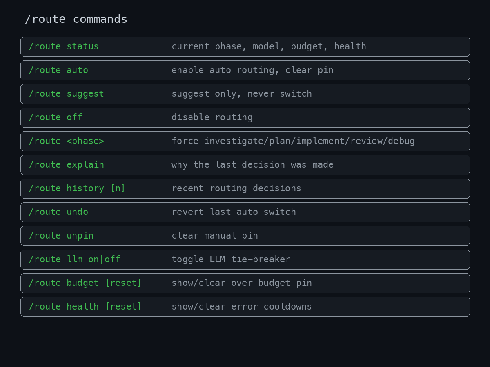
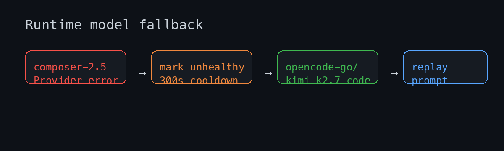

# pi-model-router



Dynamic, task-phase model routing for [Pi](https://pi.dev).

`pi-model-router` watches what you are doing and automatically selects the best
**model + reasoning level + tool set** for the current phase of work:

- investigate: read/search/explore code
- plan: architecture, design, tradeoff analysis
- implement: edit/write code
- review: PR/code review and risk analysis
- debug: stacktraces, logs, failures, repros

It is heuristic-first, transparent, sticky enough to avoid model thrash, and
respects manual model pins. If a provider/model errors mid-turn, it can mark that
model unhealthy, switch to a similar available model, and replay the prompt.

## Features



- **Automatic phase routing** — switches model, reasoning level, and active tools
  based on prompt signals and recent tool usage.
- **Sticky phases** — avoids flip-flopping by requiring strong evidence before
  changing phase.
- **Hybrid confidence UX** — high confidence switches; medium confidence suggests;
  low confidence stays put.
- **Manual pin respected** — choosing a model manually pauses auto-routing until
  `/route auto` or `/route unpin`.
- **Runtime model fallback** — provider errors, SDK failures, rate limits, or
  outages can trigger an automatic hop to a similar healthy model.
- **Prompt replay after fallback** — the original prompt is replayed after a safe
  fallback model is selected.
- **Budget guard** — tracks session spend and can pin to a cheaper route when the
  configured budget is exceeded.
- **Calibration** — `/route undo` and manual corrections nudge weights over time.
- **Transparency** — `/route status`, `/route explain`, history, health, footer
  status, and JSONL decision logs.

## Install

> Security: Pi extensions run with your local user permissions. Review source
> before installing any third-party extension.

### From GitHub

```bash
pi install git:github.com/Davidcreador/pi-model-router@v1.0.0
```

Or from a branch/commit while testing:

```bash
pi install git:github.com/Davidcreador/pi-model-router@main
```

### From npm

```bash
pi install npm:pi-model-router@1.0.0
```

### From a local checkout

```bash
git clone https://github.com/Davidcreador/pi-model-router.git
pi install ./pi-model-router
```

### Try without installing

```bash
pi -e git:github.com/Davidcreador/pi-model-router@main
```

After installing, restart Pi or run:

```text
/reload
```

## Quick start

Use Pi normally. The footer will show the active route:

```text
route:investigate · composer-2.5:fast
route:plan · gpt-5.5 · xhigh
route:PINNED claude-opus-4-8
```

Useful first commands:

```text
/route status
/route explain
/route history 10
```

## Commands



| Command | Effect |
| --- | --- |
| `/route` / `/route status` | Show mode, phase, model, pin, budget, and health state. |
| `/route auto` | Enable automatic routing and clear manual/budget pins. |
| `/route suggest` | Suggest route changes without switching automatically. |
| `/route off` | Disable routing. |
| `/route investigate` | Force investigate route. |
| `/route plan` | Force plan route. |
| `/route implement` | Force implement route. |
| `/route review` | Force review route. |
| `/route debug` | Force debug route. |
| `/route explain` | Explain the last routing decision. |
| `/route history [n]` | Show recent routing decisions. |
| `/route undo` | Revert the last auto switch and learn from it. |
| `/route unpin` | Clear a manual pin. |
| `/route llm on\|off` | Toggle the optional LLM tie-breaker. |
| `/route budget [reset]` | Show spend or clear the over-budget pin. |
| `/route health [reset]` | Show or clear model error cooldowns. |
| `/route calibration reset` | Clear learned calibration weights. |
| `/route reload` | Reload config from disk. |

Shortcut: `Ctrl+Shift+R` cycles `auto → suggest → off` when the key is free.

## Configuration

Global config is created on first run:

```text
~/.pi/agent/model-router.json
```

Project override, deep-merged with global config:

```text
<project>/.pi/model-router.json
```

Reload after edits:

```text
/route reload
```

Minimal example:

```json
{
  "mode": "auto",
  "defaultRoute": "implement",
  "routes": {
    "investigate": {
      "model": "cursor/composer-2.5:fast",
      "thinkingLevel": "off",
      "tools": ["read", "grep", "find", "ls"]
    },
    "plan": {
      "model": "openai-codex/gpt-5.5",
      "thinkingLevel": "xhigh"
    },
    "implement": {
      "model": "anthropic/claude-sonnet-4-6",
      "thinkingLevel": "high"
    },
    "review": {
      "model": "anthropic/claude-opus-4-8",
      "thinkingLevel": "high"
    },
    "debug": {
      "model": "openai-codex/gpt-5.5",
      "thinkingLevel": "xhigh"
    }
  }
}
```

See [`model-router.example.json`](./model-router.example.json) for a fuller
starter config.

## Runtime fallback



When a selected model errors after Pi's own retry path, the router can:

1. mark the current model unhealthy for a cooldown window,
2. choose the next similar configured and authenticated model,
3. switch to that model,
4. replay the original prompt,
5. skip the failed model on later turns until cooldown expires.

Example fallback config:

```json
{
  "runtimeFallback": {
    "enabled": true,
    "retryAttempts": 2,
    "maxAttemptsPerTurn": 2,
    "cooldownMs": 300000
  },
  "modelFallbacks": {
    "cursor/composer-2.5:fast": [
      "opencode-go/kimi-k2.7-code",
      "openai-codex/gpt-5.4-mini",
      "anthropic/claude-sonnet-4-6"
    ]
  }
}
```

The fallback picker only selects models that are registered, authenticated,
healthy, and compatible with the input type (for example, image prompts require
an image-capable model).

## How routing works

For each interactive prompt, the router combines:

- prompt keywords and verbs,
- route-specific lexicon weights,
- hard signals such as stacktraces, diffs, code-review phrasing, and images,
- recent tool usage,
- optional cheap LLM classification for ambiguous prompts,
- sticky phase and confidence thresholds,
- manual pins and budget pins.

It then chooses one of three outcomes:

- **switch** — high confidence; route now,
- **suggest** — medium confidence; show footer suggestion,
- **stay** — low confidence or sticky phase wins.

## Troubleshooting

### The router is not changing models

Check mode and pin state:

```text
/route status
```

If you see `PINNED`, clear it:

```text
/route auto
```

### A model is being skipped

Check health cooldowns:

```text
/route health
```

Clear cooldowns:

```text
/route health reset
```

### Routing feels wrong

Inspect the last decision:

```text
/route explain
```

Force the desired route once:

```text
/route review
```

If you undo an auto switch, calibration learns from it:

```text
/route undo
```

### Config edits are not applied

Run:

```text
/route reload
```

## Development

```bash
npm install
npm run typecheck
pi -e ./extensions/model-router
```

Local package install test:

```bash
pi install ./
/reload
/route status
```

## Release

1. Update `CHANGELOG.md`.
2. Bump `package.json` version.
3. Tag the release:

```bash
git tag v1.0.0
git push origin main --tags
```

The included GitHub Actions workflows run CI on pull requests and create a
GitHub release for version tags. npm publishing is available through
`.github/workflows/publish.yml` when `NPM_TOKEN` is configured.

## License

MIT
